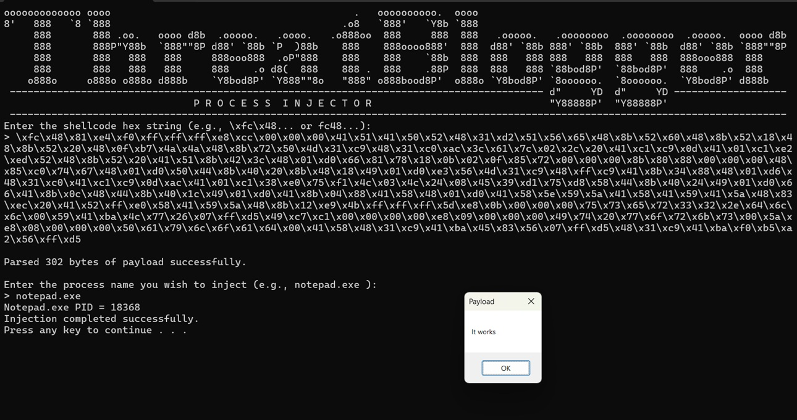

This is the Threatblogger process injector, a C/C++ native utility designed to execute arbitrary 64-bit shellcode within the virtual address space of a targeted remote process. The application serves as an engineering environment to validate the execution flow, stability, and runtime behavior of 64-bit assembly payloads.
